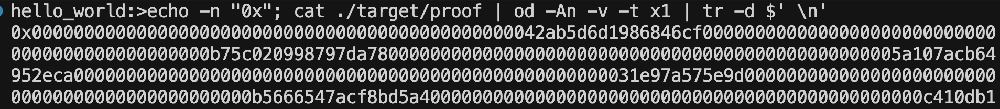

# Goal

Create a lesson plan to teach others how to learn privacy via zero knowledge with a focus on Noir.

## Lesson 1

**Objective:** Run through the [Noir quickstart](https://noir-lang.org/docs/getting_started/quick_start)

### Install Noir

```bash
# Install Noir version manager
curl -L https://raw.githubusercontent.com/noir-lang/noirup/refs/heads/main/install | bash

# Install Noir
noirup
```

### Install Barretenberg

```bash
# Install Barretenberg backend
curl -L https://raw.githubusercontent.com/AztecProtocol/aztec-packages/refs/heads/master/barretenberg/bbup/install | bash

# Install Barretenberg
bbup
```

### Initialize Project

```bash
# Create new Noir project
nargo new hello_world

# Navigate to project
cd hello_world

# Verify setup
nargo check
```

### Compile and Execute

```bash
# Create Prover.toml with inputs
echo 'x = "1"' > Prover.toml
echo 'y = "2"' >> Prover.toml

# Compile and execute (generates witness)
nargo execute
```

### Test Failing Case

```bash
# Test with x=1, y=1 (this will fail)
echo 'x = "1"' > Prover.toml
echo 'y = "1"' >> Prover.toml

# This should fail and show error
nargo execute
```

### Generate and Verify Proof

```bash
# Generate proof using Barretenberg backend
bb prove -b ./target/hello_world.json -w ./target/hello_world.gz -o ./target

# Generate verification key
bb write_vk -b ./target/hello_world.json -o ./target

# Verify proof
bb verify -k ./target/vk -p ./target/proof -i ./target/public_inputs
```

### Examine Binary Files

For the curious.

```bash
# View proof file as hex dump
xxd ./target/proof
```

## Lesson 2: Generate a Solidity Verifier

This lesson builds on the hello world example.

### Step 1 - Generate a Contract

```bash
nargo compile
```

This will compile your source code into a Noir build artifact stored in the `./target` directory. Generate the smart contract using:

```bash
# Generate verification key with keccak hash
bb write_vk -b ./target/hello_world.json -o ./target --oracle_hash keccak

# Generate Solidity verifier from the vkey
bb write_solidity_verifier -k ./target/vk -o ./target/Verifier.sol
```

A `Verifier.sol` contract is now in the target folder and can be deployed to any EVM blockchain as a verifier smart contract.

### Step 2 - Deploy via Remix

1. Go to [Remix Ethereum IDE](https://remix.ethereum.org/)
2. Create a blank project
3. Create `Verifier.sol` file and paste the contract code
4. **Important:** Enable optimizations (set to 200) due to contract size restrictions
5. Deploy HonkVerifier - Verifier.sol

### Step 3 - Use Verifier

Generate a proof with the correct output format for the deployed contract:

```bash
bb prove -b ./target/hello_world.json -w ./target/hello_world.gz -o ./target --oracle_hash keccak --output_format bytes_and_fields
```

**Understanding the parameters:**

- **`circuit-name`** = the name of your circuit's compiled JSON file (e.g., `hello_world.json`)
  - This file defines the logic and constraints of your zero-knowledge circuit
  - Generated when you run `nargo compile`
- **`witness-name`** = the name of your witness file containing the inputs for the circuit (e.g., `hello_world.gz`)
  - This file contains the private inputs (witness values) for your circuit
  - Generated when you run `nargo execute`

### Step 4 - Verify in Remix

To verify with Remix, pass the proof bytes as a hex string and public inputs as `bytes32[]`:

```bash
# Convert proof to hex string for Remix
echo -n "0x"; cat ./target/proof | od -An -v -t x1 | tr -d $' \n'
```



**Remix Interface Examples:**


_How the inputs will look in Remix_


_What a successful proof verification looks like_

**Public inputs:** Use the `./target/public_inputs_fields.json` file (generated with `--output_format bytes_and_fields`). Copy the hex array directly into Remix.
