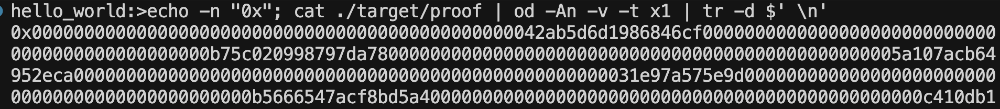
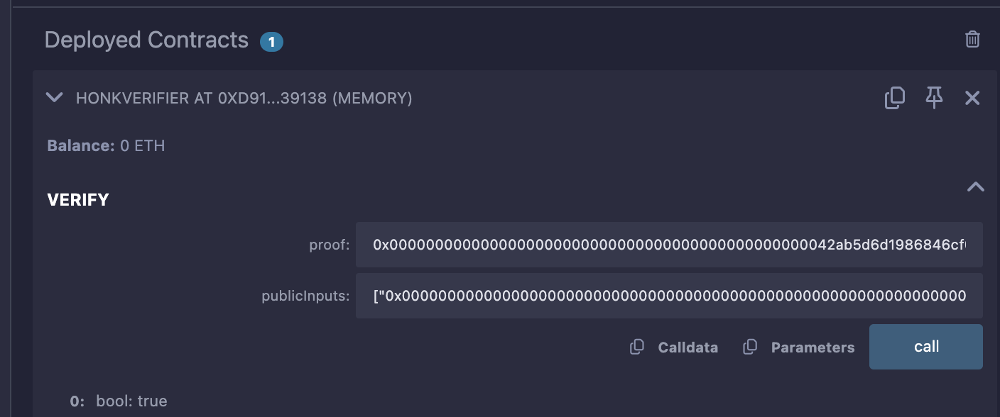
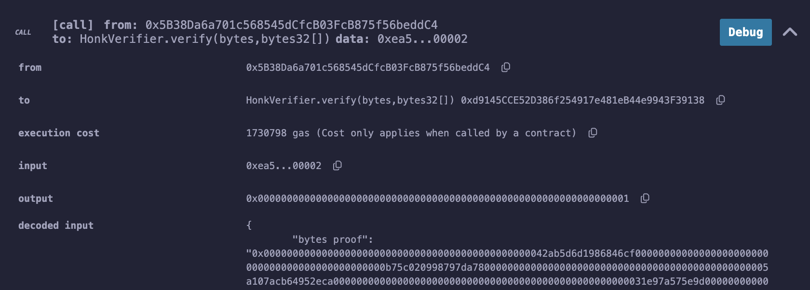

# Overview

This lesson gets you comfortable with Noir and setting up your development environment. You'll run through the basic quickstart to understand the workflow, then generate a Solidity verifier contract.

## Lesson 1: Hello World - Noir Basics

**Objective:** Run through the [Noir quickstart](https://noir-lang.org/docs/getting_started/quick_start).

### Install Noir

```bash
# Install Noir version manager
curl -L https://raw.githubusercontent.com/noir-lang/noirup/refs/heads/main/install | bash

# Install Noir
noirup
```

### Install Barretenberg

```bash
# Install Barretenberg backend
curl -L https://raw.githubusercontent.com/AztecProtocol/aztec-packages/refs/heads/master/barretenberg/bbup/install | bash

# Install Barretenberg
bbup
```

### Initialize Project

```bash
# Create new Noir project
nargo new hello_world
cd hello_world

# Verify setup
nargo check
```

### Compile and Execute

```bash
# Create Prover.toml with inputs
echo 'x = "1"' > Prover.toml
echo 'y = "2"' >> Prover.toml

# Compile and execute (generates witness)
nargo execute
```

### Test Failing Case

```bash
# Test with x=1, y=1 (this will fail)
echo 'x = "1"' > Prover.toml
echo 'y = "1"' >> Prover.toml
nargo execute
```

### Generate and Verify Proof

```bash
# Generate proof
bb prove -b ./target/hello_world.json -w ./target/hello_world.gz -o ./target

# Generate verification key
bb write_vk -b ./target/hello_world.json -o ./target

# Verify proof
bb verify -k ./target/vk -p ./target/proof -i ./target/public_inputs
```

### Examine Binary Files

For the curious.

```bash
# View proof file as hex dump
xxd ./target/proof
```

---

## Lesson 2: Generate a Solidity Verifier

**Objective:** Create a Solidity verifier contract and use it to verify zero-knowledge proofs. This lesson builds on the hello world example.

### Step 1 - Generate Contract

```bash
nargo compile

# Generate verification key with keccak hash
bb write_vk -b ./target/hello_world.json -o ./target --oracle_hash keccak

# Generate Solidity verifier
bb write_solidity_verifier -k ./target/vk -o ./target/Verifier.sol
```

A `Verifier.sol` contract is now in the target folder and can be deployed to any EVM blockchain as a verifier smart contract.

### Step 2 - Deploy via Remix

1. Go to [Remix Ethereum IDE](https://remix.ethereum.org/)
2. Create a blank project
3. Create `Verifier.sol` file and paste the contract code
4. **Important:** Enable optimizations (set to 200) due to contract size restrictions
5. Deploy HonkVerifier - Verifier.sol

### Step 3 - Generate Proof

```bash
bb prove -b ./target/hello_world.json -w ./target/hello_world.gz -o ./target --oracle_hash keccak --output_format bytes_and_fields
```

**Understanding the parameters:**

- **`circuit-name`** = the name of your circuit's compiled JSON file (e.g., `hello_world.json`)
  - This file defines the logic and constraints of your zero-knowledge circuit
  - Generated when you run `nargo compile`
- **`witness-name`** = the name of your witness file containing the inputs for the circuit (e.g., `hello_world.gz`)
  - This file contains the private inputs (witness values) for your circuit
  - Generated when you run `nargo execute`

### Step 4 - Verify in Remix

To verify with Remix, pass the proof bytes as a hex string and public inputs as `bytes32[]`:
**Public inputs:** Use `./target/public_inputs_fields.json` file. Copy the hex array directly into Remix.

```bash
# Convert proof to hex string
echo -n "0x"; cat ./target/proof | od -An -v -t x1 | tr -d $' \n'
```



**Remix Interface:**


_Input fields for proof verification_


_Successful proof verification_

## What You've Learned

By completing both lessons, you now understand:

1. **Basic Noir workflow** - from circuit definition to proof generation
2. **Proof verification** - both locally and on-chain
3. **Smart contract integration** - how ZK proofs can be verified on Ethereum
4. **Real-world applications** - the foundation for more complex privacy-preserving systems

## Next Steps

Continue to [Lesson 3: Balance Threshold Proofs](../balance_threshold/README.md) to learn how to work with live blockchain data and prove account balances without revealing addresses.
